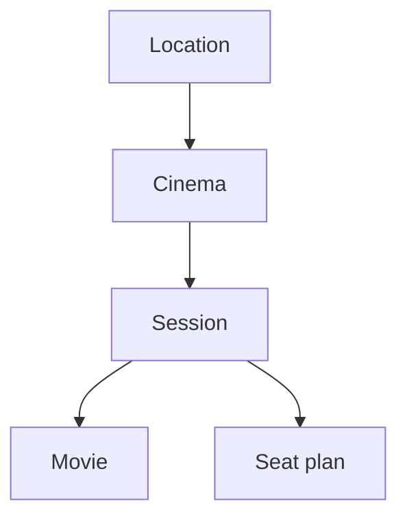

# Cineplexx Serbia API

> [!IMPORTANT]
> This project is unofficial and is not affiliated with, endorsed by, or maintained by Cineplexx.
>
> The API is undocumented and may change without notice.

This directory documents the publicly accessible HTTP API used by the Cineplexx Serbia [website](https://cineplexx.rs) and (possibly?) its mobile apps.

The documentation is based on observed requests and responses from the Cineplexx web client. It primarily supports [the client found in this repo](/src/SeatPeek.Cineplexx.Rs.Web), but should also be useful for building other clients.

Other Cineplexx regions have not been investigated (for now?) and may use different APIs.

## Base URL

```text
https://app.cineplexx.rs/api
```

### API "versions"

Observed endpoints exist under `/v1`, `/v2`, and `/v3`, but their relationship is unknown.

They do not appear to represent complete successive versions of the same API: not every `/v1` endpoint has a `/v2` equivalent, and `/v3` has so far only been observed for movie session endpoints.

Clients should therefore treat each documented endpoint independently rather than assuming that a higher version supersedes a lower one.

## API overview

The useful read-only API broadly follows:



To find seats for a screening, first choose a location, get its cinemas, retrieve a cinema’s sessions, then fetch session details. Fetch the seat plan only if you need individual seats.

## Identifiers

Common identifiers include:

```text
location ID        2
cinema ID          1116
movie ID           HO00019842
corporate film ID  A000021419
movie slug         pera-kojot-protiv-sistema
session ID         11942
session key        1116-11942
```

See [concepts.md](./concepts.md) for their relationships and meaning.

## Documentation

* [concepts.md](./concepts.md) — identifiers and resource relationships
* [endpoints.md](./endpoints.md) — endpoint reference
* [workflows.md](./workflows.md) — tutorial-style client integration

An experimental OpenAPI specification will eventually live under `/openapi/`.

## Usage

Clients should avoid unnecessary requests, cache relatively static data where appropriate, and only fetch seat plans when seat-level information is actually needed.

For occupancy information, session metadata should be preferred when it already provides total and available seat counts.

> [!WARNING]
> Content returned by the API may be protected by copyright. Cineplexx's [terms](http://archive.today/2026.08.11-220325/https://app.cineplexx.rs/api/v1/media/files?path=Uslovi%20koriscenja%20internet%20stranice%20www.cineplexx.rs.pdf) [accessed: 2026-08-11] prohibit unauthorized use or redistribution of materials such as images, posters, descriptions, and other copyrighted content.
>
> This repository documents the API structure and behaviour only. Developers are responsible for ensuring that their clients do not reproduce or redistribute protected content in violation of the applicable terms or copyright law.
