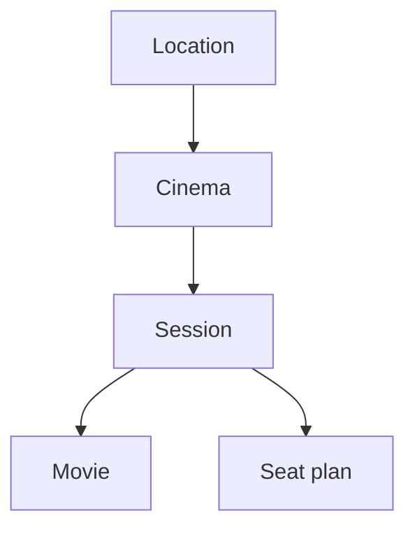
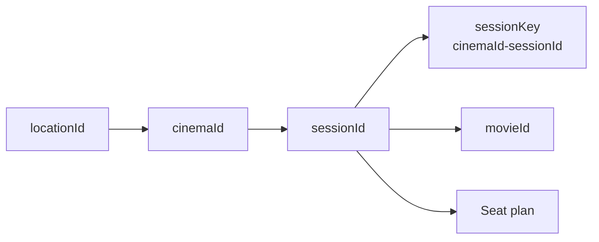

# API Concepts

This page explains the main resources and identifiers used by the Cineplexx Serbia API.

## Resources

The read-only API can broadly be understood as:



A location contains cinemas.

A cinema has scheduled sessions.

Each session represents a screening of a movie and has an associated seat plan.

Besides that, the API also exposes website-oriented aggregated resources such as `/moviesweb` and `/cinemasweb`.

## Location

A location represents a city.

Locations use numeric identifiers:

```text
locationId
```

A location can contain one or more cinemas.

The location ID is primarily used to select cinemas and programme data (cinema's sessions) for a particular area.

## Cinema

A cinema represents a physical Cineplexx venue.

It is identified by a numeric ID:

```text
cinemaId
```

Cinema IDs are used by the cinema programme, session, and seat-plan requests.

## Movie

A movie represents a film in the Cineplexx catalogue.

Movies have several identifiers.

Example:

```text
title             Pera kojot protiv sistema
movie ID          HO00019842
corporate film ID A000021419
HO film code      A000021419
movie slug        pera-kojot-protiv-sistema
```

The primary movie identifier observed in programme and session APIs has the form:

```text
HO00019842
```

Some movie-detail endpoints also accept the human-readable slug.

The `corporateFilmId` and `HOFilmCode` fields have been observed to contain the same value for this movie, but clients should not assume that they are universally interchangeable.

## Upcoming movies

A movie may exist in the catalogue before any screenings have been scheduled.

For example, a movie can appear through the `coming-soon` API while having no associated sessions.

Therefore:

```text
Movie exists ≠ Movie has sessions
```

Clients should discover sessions separately rather than infer screening availability from the existence of a movie record. It's safer that way.

## Session

A session represents one screening of a movie at a specific cinema and time.

Sessions have their own numeric identifier:

```text
sessionId
```

Cineplexx also uses a composite session key:

```text
{cinemaId}-{sessionId}
```

Example:

```text
1116-11942
│    │
│    └── sessionId
└────── cinemaId
```

The session-detail endpoint uses this composite form.

Seat-plan endpoints instead use `cinemaId` and `sessionId` as separate path parameters.

Session details also include a `scheduledFilm` object containing movie information associated with the screening.

## Seat plan

A seat plan represents individual seats for one session.

It is addressed using:

```text
cinemaId
+
sessionId
```

Session metadata can already provide aggregate values such as:

```text
seatsAvailable
seatsTotal
```

These values are enough to calculate occupancy:

```text
filledSeats = seatsTotal - seatsAvailable

occupancy = filledSeats / seatsTotal
```

A full seat-plan request is only necessary when seat-level information is needed, such as determining whether desirable central seats are available.

## Identifier relationships

The identifiers most commonly used when navigating the API are:



The exact endpoints using these identifiers are documented in [endpoints.md](./endpoints.md).

For practical request sequences, see [workflows.md](./workflows.md).
