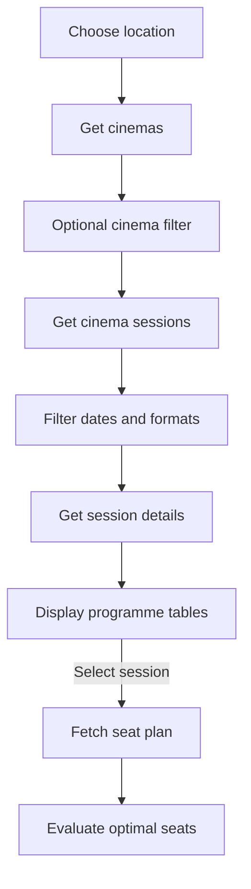

# Workflows

## Get cinemas for a location

```http
GET /v1/locations
```

Use the selected location to obtain its cinema IDs.

## Get sessions for a cinema

```http
GET /v1/cinemas/{cinemaId}/sessions
```

Returns the cinema programme grouped by date.

Sessions include identifiers and technologies, which can be used for format filtering.

## Get screening details

```http
GET /v1/sessions/{sessionKey}
```

where:

```text
sessionKey = {cinemaId}-{sessionId}
```

Useful fields include:

```text
showtime
seatsAvailable
seatsTotal
scheduledFilm
screenName
sessionAttributesNames
```

## Ticket purchase

Each session can link directly to:

```text
https://cineplexx.rs/purchase/wizard/{sessionKey}/tickets
```

## Calculate free-seat percentage

```text
freePercentage = seatsAvailable / seatsTotal * 100
```

No seat-plan request is required.

## Check individual seats

```http
GET /v1/seat-plan/{cinemaId}/{sessionId}
```

Use this only when seat-level information is required, such as determining whether desirable central seats remain available.

## MVP flow example



If no cinema is selected, fetch sessions for all cinemas in the selected location and merge them.

Each row initially can display:

```text
time | movie | free seats | tickets
```

When a row is selected:

```text
fetch seat plan
    ↓
evaluate optimal seats
```

The row then can display:

```text
time | movie | optimal seats | free seats | tickets
```
